# HRX-AI 設計図・ビジュアル資料集

ここでは、次世代スーパー人事AIエージェント「HRX-AI」の構造、開発計画、ユーザー体験、データフロー、プロセス、RAGアーキテクチャ、セキュリティアーキテクチャ、データモデル、テスト戦略を視覚的に表現した。

1. まず「何を作るのか」（機能と体験）を理解
2. 次に「どのように作るのか」（アーキテクチャと技術）を把握
3. その後「どのように動くのか」（特定機能の詳細フロー）を確認
4. 最後に「どう進めていくのか」（テスト・開発・展開計画）を把握

## 目次

```
1. 機能マインドマップ - プロダクトの全機能概要
2. ユーザージャーニーマップ - 利用者体験の流れ
3. システムアーキテクチャ図 - 全体システム構造
4. 技術スタック連携図 - 使用技術の詳細
5. RAGアーキテクチャ詳細図 - AI機能コアの動作
6. データフロー図 - データの流れと処理
7. データモデルER図 - データベース設計
8. エンプロイーライフサイクルマップ - 従業員サポート機能
9. 統合APIアーキテクチャ - API構成
10. セキュリティアーキテクチャ図 - セキュリティ実装
11. ユーザーインターフェース主要画面フロー - 画面遷移
12. 離職リスク予測シーケンス図 - 特定機能の詳細
13. AI採用プロセスフローチャート - 特定機能の詳細
14. テスト戦略マップ - 品質保証計画
15. モニタリング・オブザーバビリティフレームワーク - 運用監視
16. 開発ガントチャート - 開発スケジュール
17. 成長戦略・収益化ロードマップ - 事業展開計画
```


## 1. 機能マインドマップ - プロダクトの全機能概要
```
プロダクトの全機能概要
```

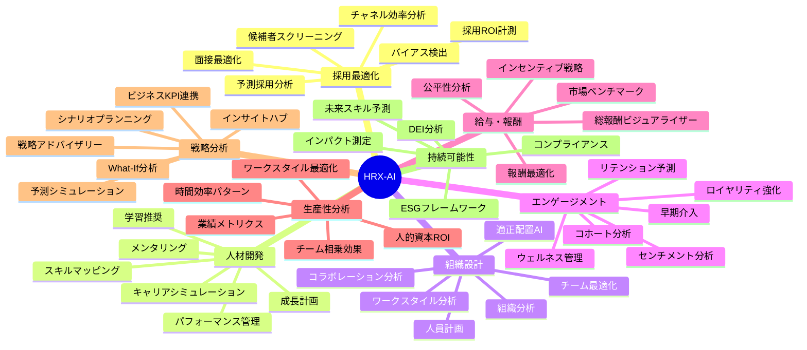

## 2. ユーザージャーニーマップ - 利用者体験の流れ
```
利用者体験の流れ
```

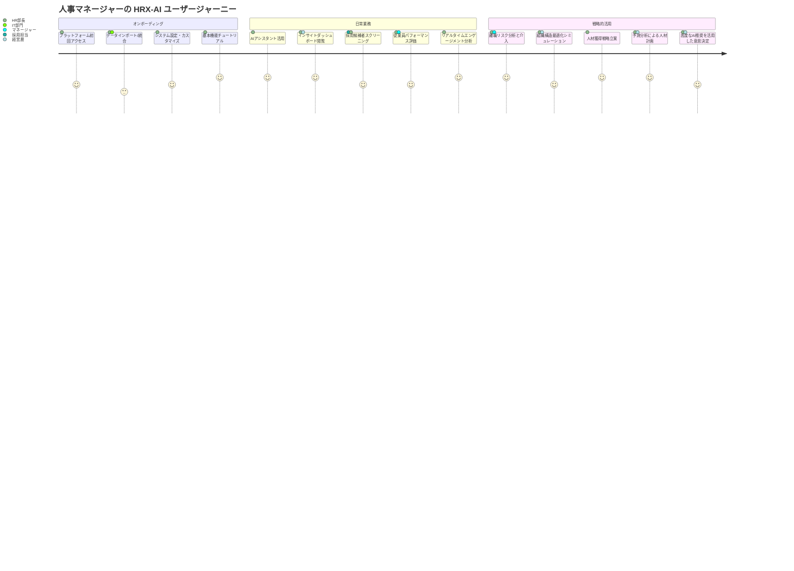

## 3. システムアーキテクチャ図 - 全体システム構造
```
全体システム構造
```

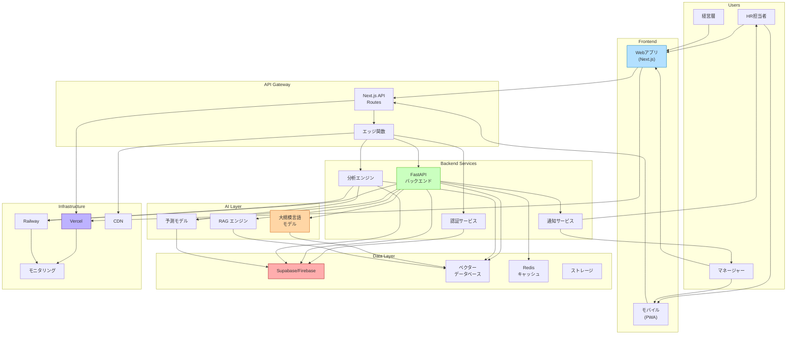


## 4. 技術スタック連携図 - 使用技術の詳細
```
使用技術の詳細
```

```mermaid
flowchart TB
    subgraph "クライアント層"
        Next["Next.js 14+<br>App Router"]
        React["React 18+"]
        TS["TypeScript 5+"]
        Tailwind["Tailwind CSS 3+"]
        ShadcnUI["Shadcn/UI"]
        TanStack["TanStack Query 5"]
        Zustand["Zustand"]
        Framer["Framer Motion"]
    end
    
    subgraph "API層"
        NextAPI["Next.js API Routes"]
        FastAPI["FastAPI (Python)"]
        tRPC["tRPC"]
        Webhooks["イベントドリブン<br>Webhooks"]
    end
    
    subgraph "AI/ML層"
        LangChain["LangChain/<br>LlamaIndex"]
        LLMs["GPT-4o/Claude 3/Gemini 2.0 or 2.5"]
        HF["HuggingFace<br>Transformers"]
        ONNX["ONNX Runtime"]
        PyTorch["PyTorch/JAX"]
    end
    
    subgraph "データ層"
        Supabase["Firebase/<br>Supabase"]
        VectorDB["ベクトル<br>データベース"]
        Redis["Redis/Upstash"]
        Pandas["Pandas/Polars"]
        Pipelines["Dagster/Airflow"]
    end
    
    subgraph "インフラ層"
        Edge["Vercel/Cloudflare"]
        Deploy["Railway/Fly.io"]
        GitHub["GitHub Actions"]
        Docker["Docker/K8s"]
        IaC["Terraform/Pulumi"]
    end
    
    Next --> |SSR/CSR| React
    Next --> |API Routes| NextAPI
    React --> TS
    React --> Tailwind
    React --> ShadcnUI
    React --> TanStack
    React --> Zustand
    React --> Framer
    
    NextAPI --> FastAPI
    NextAPI --> tRPC
    NextAPI --> Webhooks
    
    FastAPI --> LangChain
    FastAPI --> Pandas
    FastAPI --> Pipelines
    
    LangChain --> LLMs
    LangChain --> HF
    LangChain --> ONNX
    PyTorch --> LLMs
    
    TanStack --> Supabase
    FastAPI --> Supabase
    FastAPI --> VectorDB
    FastAPI --> Redis
    
    Webhooks --> Supabase
    
    Next --> Edge
    FastAPI --> Deploy
    GitHub --> Edge
    GitHub --> Deploy
    Docker --> Deploy
    IaC --> Edge
    IaC --> Deploy
    
    style Next fill:#b3e0ff,stroke:#0077b6
    style FastAPI fill:#caffbf,stroke:#38b000
    style LLMs fill:#ffd6a5,stroke:#cc5500
    style Supabase fill:#ffadad,stroke:#9d0208
    style Edge fill:#bdb2ff,stroke:#5a189a
```


## 5. RAG（検索拡張生成）アーキテクチャ詳細図 - AI機能コアの動作
```
AI機能コアの動作
```

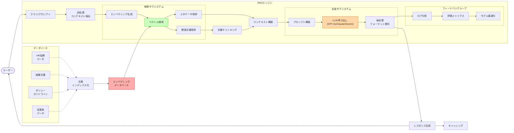


## 6. データフロー図 - データの流れと処理
```
データの流れと処理
```

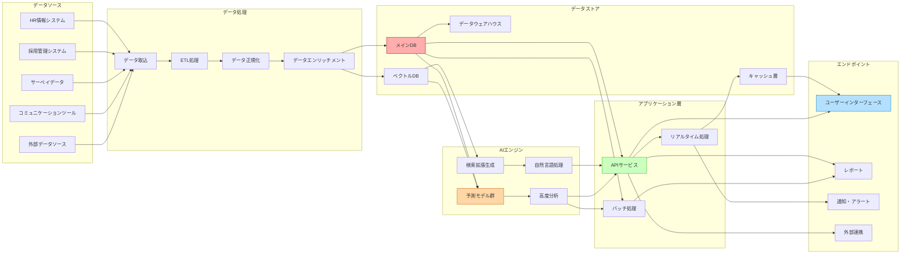


## 7. データモデルER図 - データベース設計
```
データベース設計
```

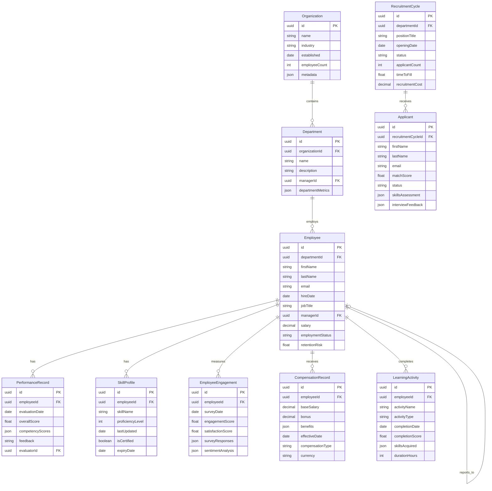


## 8. エンプロイーライフサイクルマップ - 従業員サポート機能
```
従業員サポート機能
```


## 9. 統合APIアーキテクチャ - API構成
```
API構成
```

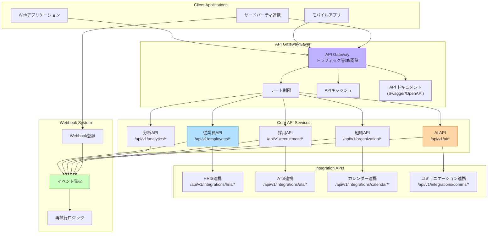


## 10. セキュリティアーキテクチャ図 - セキュリティ実装
```
セキュリティ実装
```

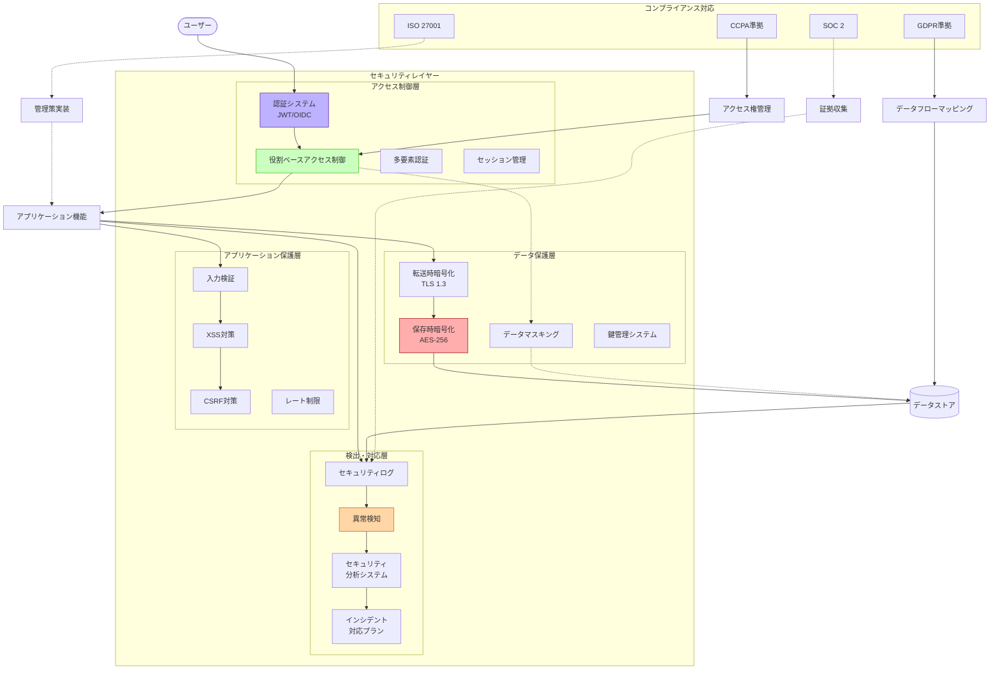

## 11. ユーザーインターフェース主要画面フロー - 画面遷移
```
画面遷移
```

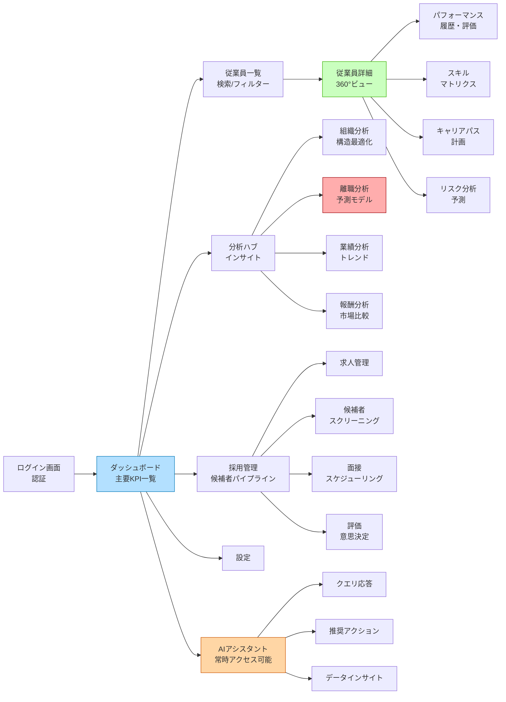


## 12. 給与・報酬分析ワークフロー図 - 特定機能の詳細
```
特定機能の詳細
```

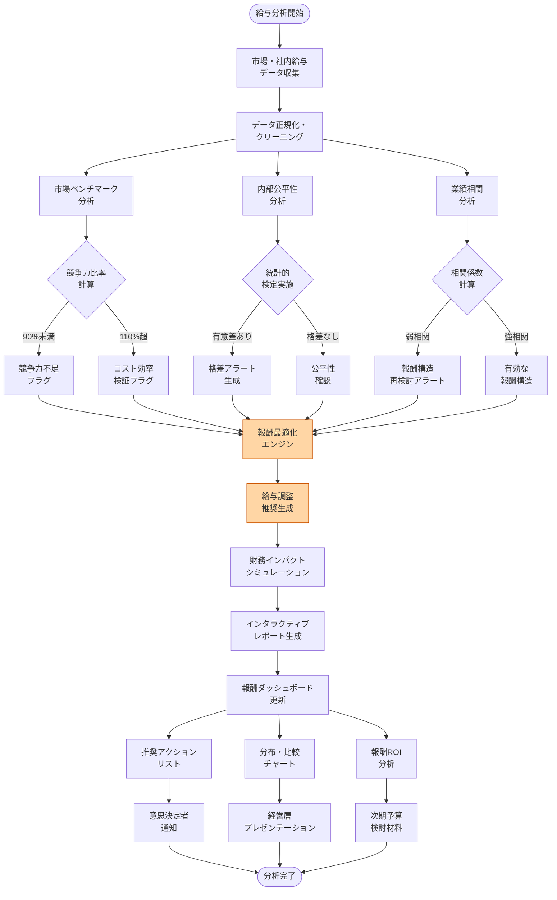


## 13. 離職リスク予測シーケンス図 - 特定機能の詳細
```
特定機能の詳細
```

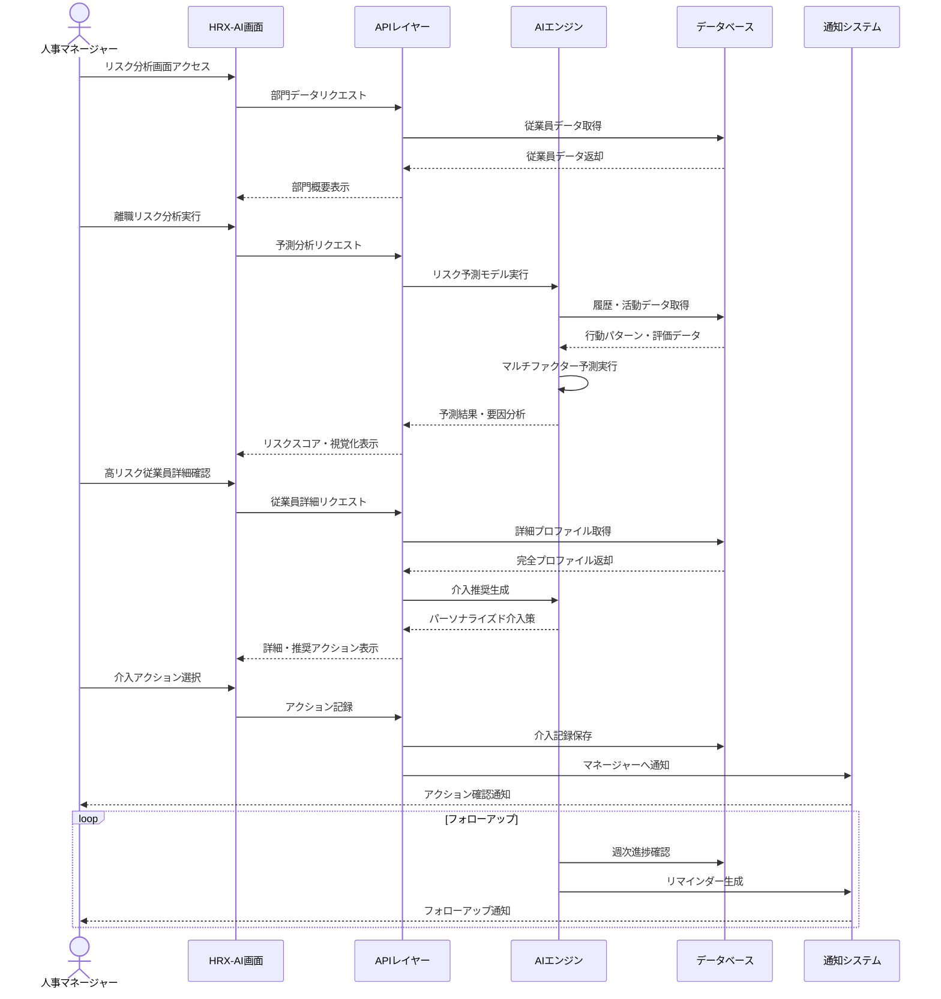


## 14. AI採用プロセスフローチャート - 特定機能の詳細
```
特定機能の詳細
```


## 15. 従業員エンゲージメント分析フロー図 - 特定機能の詳細
```
特定機能の詳細
```

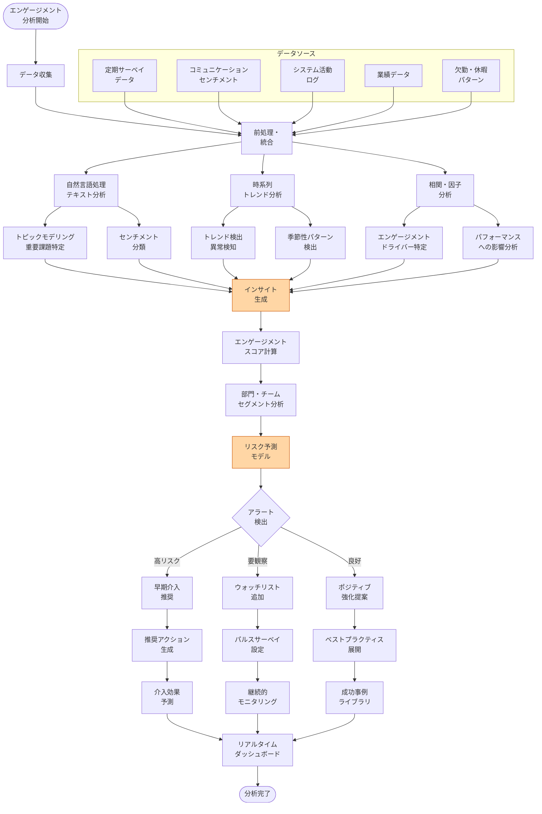

## 16. テスト戦略マップ - 品質保証計画
```
品質保証計画
```

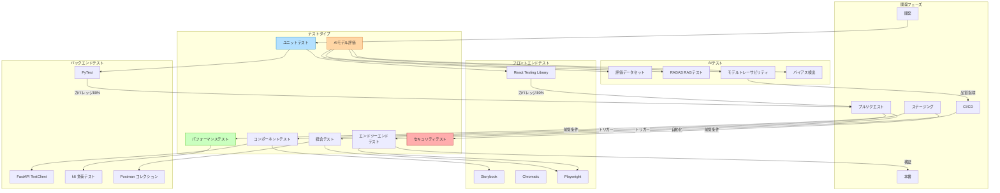


## 17. モニタリング・オブザーバビリティフレームワーク - 運用監視
```
運用監視
```

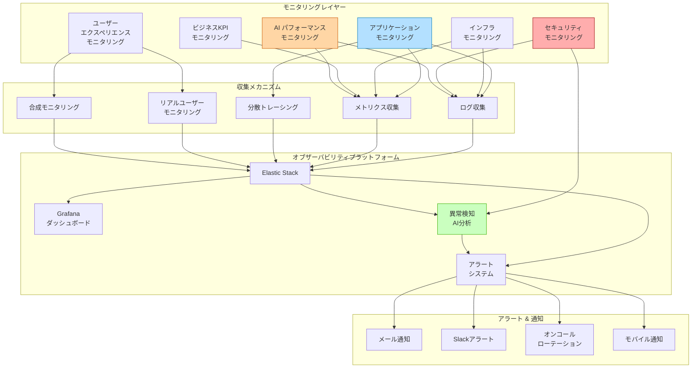


## 18. 開発ガントチャート - 開発スケジュール
```
開発スケジュール
```

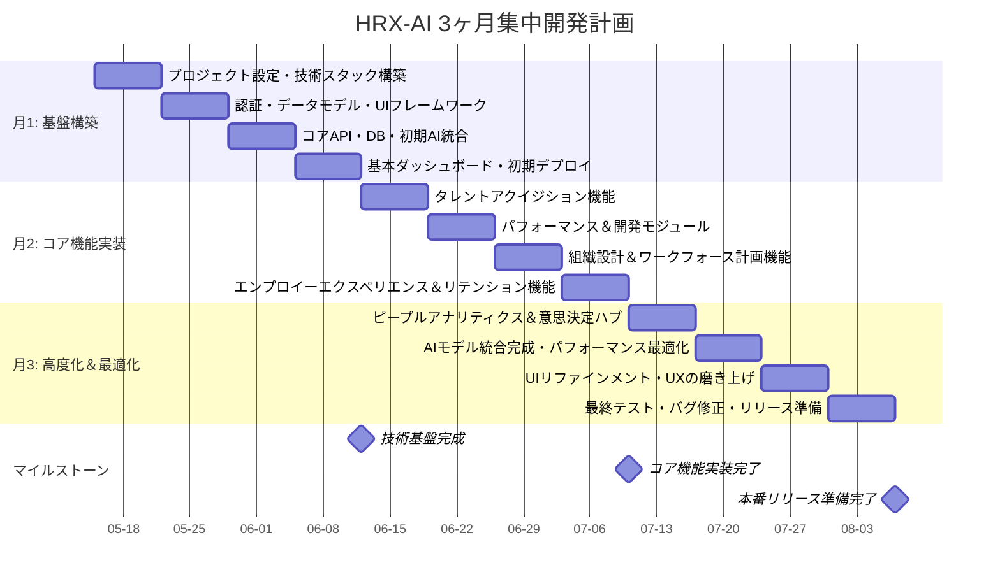


## 19. 成長戦略・収益化ロードマップ - 事業展開計画
```
事業展開計画
```

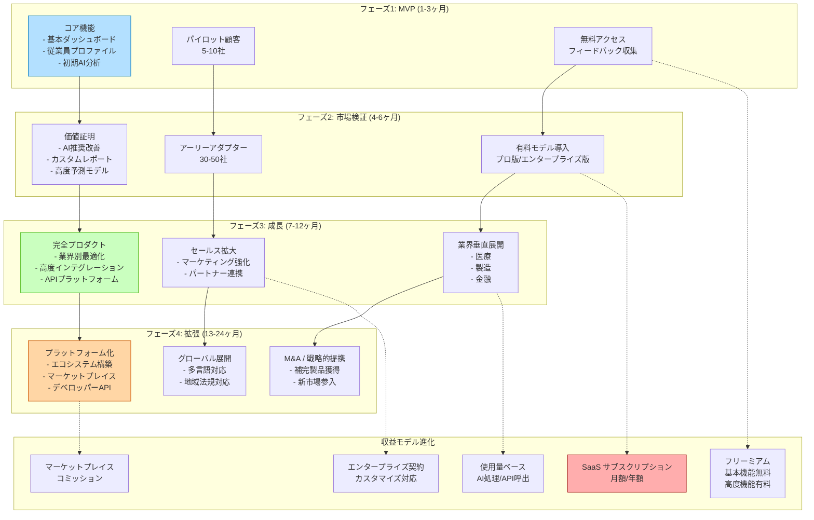
