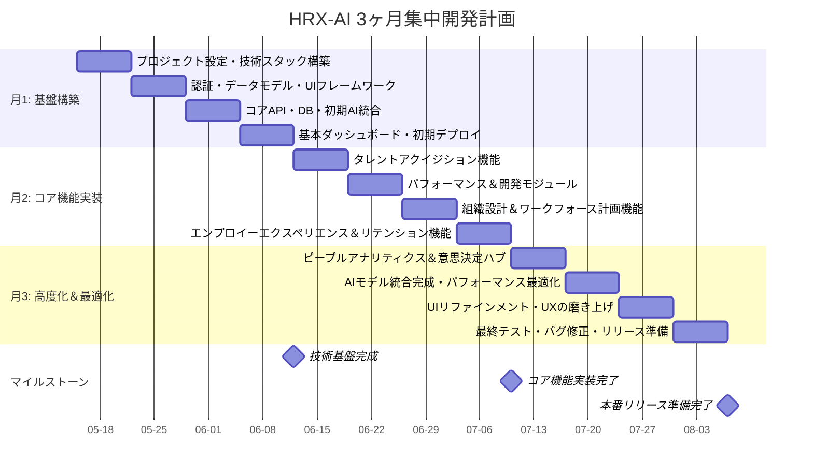
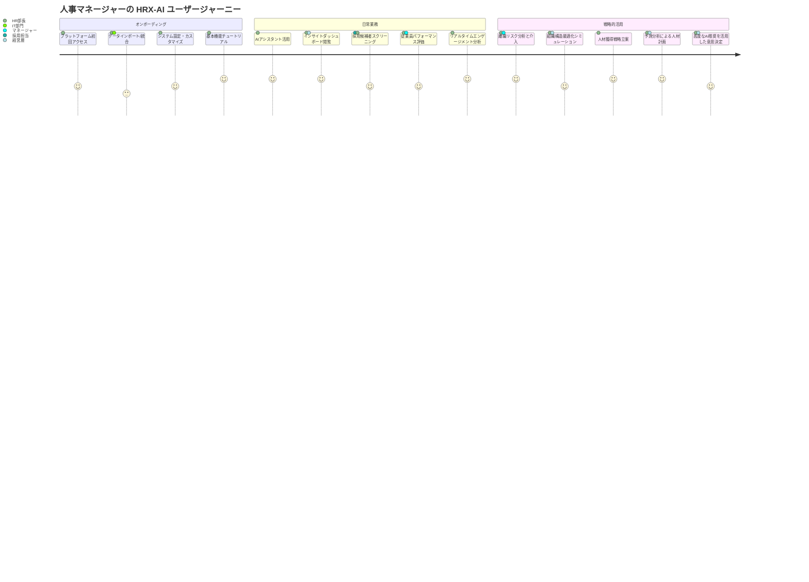
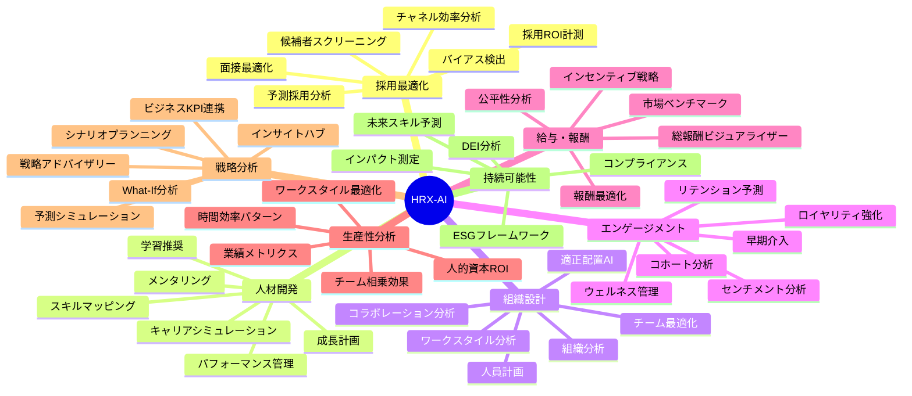
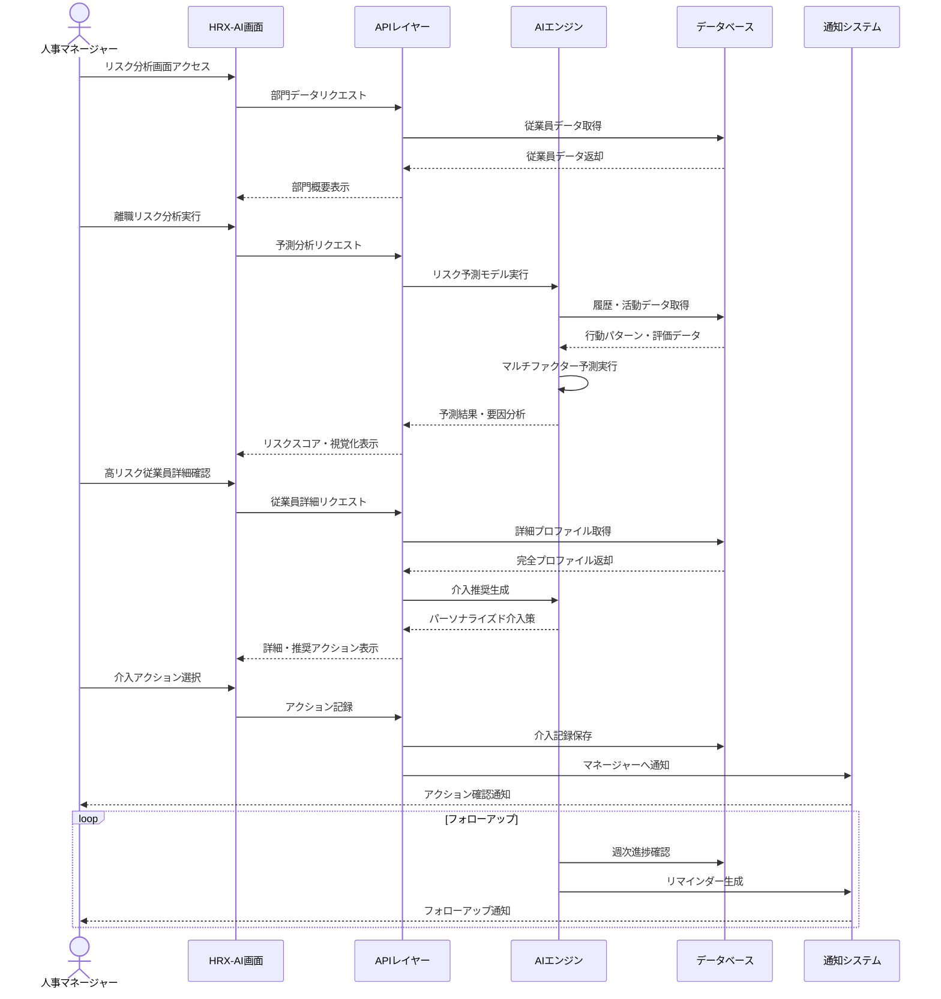
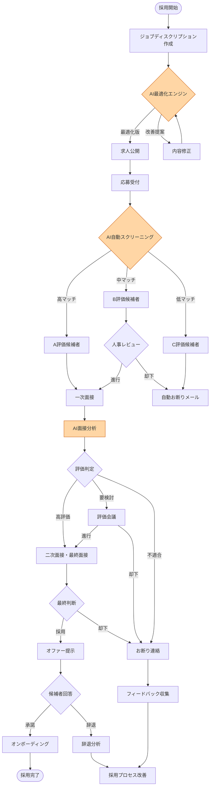
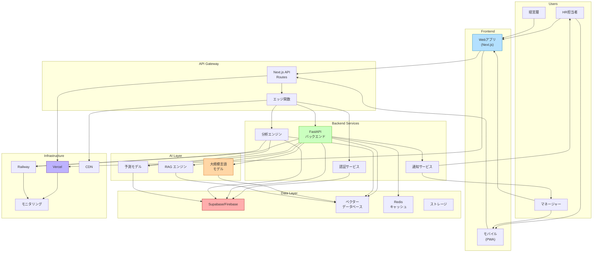
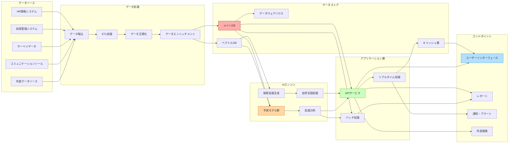
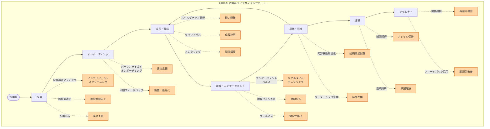

# HRX-AI 設計図・ビジュアル資料集

ここでは、次世代スーパー人事AIエージェント「HRX-AI」の構造、開発計画、ユーザー体験、データフロー、プロセスを視覚的に表現。

## 1. 技術スタック連携図

```mermaid
flowchart TB
    subgraph "クライアント層"
        Next["Next.js 14+<br>App Router"]
        React["React 18+"]
        TS["TypeScript 5+"]
        Tailwind["Tailwind CSS 3+"]
        ShadcnUI["Shadcn/UI"]
        TanStack["TanStack Query 5"]
        Zustand["Zustand"]
        Framer["Framer Motion"]
    end
    
    subgraph "API層"
        NextAPI["Next.js API Routes"]
        FastAPI["FastAPI (Python)"]
        tRPC["tRPC"]
        Webhooks["イベントドリブン<br>Webhooks"]
    end
    
    subgraph "AI/ML層"
        LangChain["LangChain/<br>LlamaIndex"]
        LLMs["GPT-4o/Claude 3/Gemini 2.0 or 2.5"]
        HF["HuggingFace<br>Transformers"]
        ONNX["ONNX Runtime"]
        PyTorch["PyTorch/JAX"]
    end
    
    subgraph "データ層"
        Supabase["Firebase/<br>Supabase"]
        VectorDB["ベクトル<br>データベース"]
        Redis["Redis/Upstash"]
        Pandas["Pandas/Polars"]
        Pipelines["Dagster/Airflow"]
    end
    
    subgraph "インフラ層"
        Edge["Vercel/Cloudflare"]
        Deploy["Railway/Fly.io"]
        GitHub["GitHub Actions"]
        Docker["Docker/K8s"]
        IaC["Terraform/Pulumi"]
    end
    
    Next --> |SSR/CSR| React
    Next --> |API Routes| NextAPI
    React --> TS
    React --> Tailwind
    React --> ShadcnUI
    React --> TanStack
    React --> Zustand
    React --> Framer
    
    NextAPI --> FastAPI
    NextAPI --> tRPC
    NextAPI --> Webhooks
    
    FastAPI --> LangChain
    FastAPI --> Pandas
    FastAPI --> Pipelines
    
    LangChain --> LLMs
    LangChain --> HF
    LangChain --> ONNX
    PyTorch --> LLMs
    
    TanStack --> Supabase
    FastAPI --> Supabase
    FastAPI --> VectorDB
    FastAPI --> Redis
    
    Webhooks --> Supabase
    
    Next --> Edge
    FastAPI --> Deploy
    GitHub --> Edge
    GitHub --> Deploy
    Docker --> Deploy
    IaC --> Edge
    IaC --> Deploy
    
    style Next fill:#b3e0ff,stroke:#0077b6
    style FastAPI fill:#caffbf,stroke:#38b000
    style LLMs fill:#ffd6a5,stroke:#cc5500
    style Supabase fill:#ffadad,stroke:#9d0208
    style Edge fill:#bdb2ff,stroke:#5a189a
```

## 2. 開発ガントチャート

## 3. ユーザージャーニーマップ

## 4. 機能マインドマップ

## 5. 離職リスク予測シーケンス図

## 6. AI採用プロセスフローチャート

## 7. システムアーキテクチャ図

## 8. データフロー図

## 9. エンプロイーライフサイクルマップ

