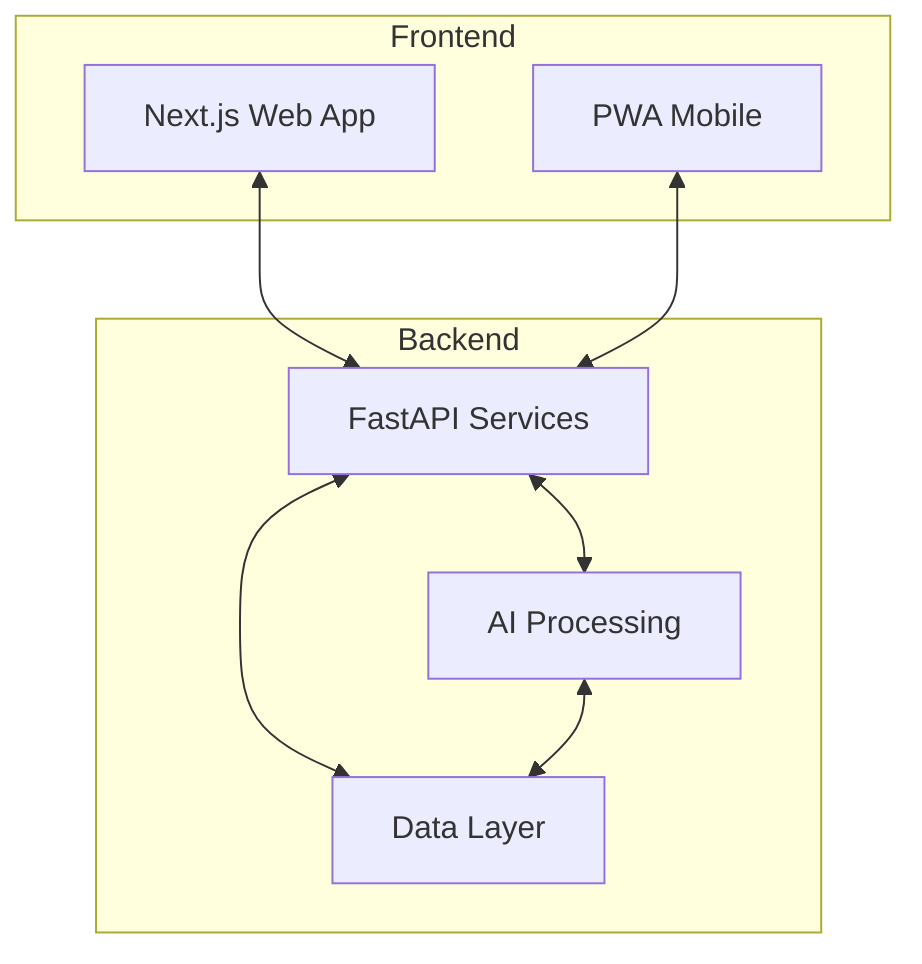

# HRX-AI - Next-generation HR AI agent

HRX-AI is an advanced HR AI agent that revolutionizes human resources management through cutting-edge AI technology and intuitive user experience. It empowers HR departments to become strategic partners within organizations by optimizing recruitment processes, enhancing employee engagement, and enabling data-driven talent decisions.

## Features

- 🔍 **AI-Powered Talent Acquisition** - Intelligent candidate screening, predictive hiring analytics, and interview optimization systems
- 📊 **Dynamic Performance Management** - Continuous feedback systems, goal tracking, and contextual performance evaluation
- 🧠 **Skills & Competency Mapping** - Organizational skill graphs, automatic skill gap detection, and future-oriented skill prediction
- 🏢 **Organizational Design & Workforce Planning** - Team optimization models, collaboration pattern analysis, and strategic staffing forecasts
- ❤️ **Employee Experience & Retention** - Multi-factor attrition risk prediction, engagement analytics, and wellness optimization
- 📈 **People Analytics & Decision Hub** - Executive insights, predictive modeling, and AI-assisted decision support

## Architecture

HRX-AI's architecture combines Next.js frontend with FastAPI backend, leveraging advanced AI models through a scalable microservices approach:



## Getting Started

### Prerequisites

- Node.js 18+
- Python 3.11+
- Docker & Docker Compose

### Installation

1. Clone the repository
   ```bash
   git clone https://github.com/yourusername/hrx-ai.git
   cd hrx-ai
   ```

2. Install frontend dependencies
   ```bash
   cd frontend
   npm install
   ```

3. Install backend dependencies
   ```bash
   cd backend
   python -m venv venv
   source venv/bin/activate  # On Windows: venv\Scripts\activate
   pip install -r requirements.txt
   ```

4. Set up environment variables
   ```bash
   cp frontend/.env.example frontend/.env.local
   cp backend/.env.example backend/.env
   ```

5. Start development servers
   ```bash
   # Terminal 1: Frontend
   cd frontend
   npm run dev
   
   # Terminal 2: Backend
   cd backend
   uvicorn app.main:app --reload
   ```

## Tech Stack

### Frontend
- Next.js 14+ (App Router)
- React 18+
- TypeScript
- Tailwind CSS
- Shadcn/UI
- TanStack Query
- Zustand
- Framer Motion

### Backend
- Python 3.11+
- FastAPI
- Supabase/Firebase
- Redis/Upstash
- tRPC

### AI/ML
- LangChain/LlamaIndex
- GPT-4o/Claude 3 Opus
- Hugging Face Transformers
- ONNX Runtime
- PyTorch/JAX

### Infrastructure
- Vercel/Cloudflare
- Railway/Fly.io
- Docker/Kubernetes
- GitHub Actions
- Terraform/Pulumi

## Roadmap

- **Phase 1 (Month 1)**: Foundation building - core tech stack setup, authentication, basic UI
- **Phase 2 (Month 2)**: Core functionality implementation - talent acquisition, performance modules
- **Phase 3 (Month 3)**: Advanced features and optimization - analytics hub, AI model integration

## License

This project is licensed under the MIT License - see the [LICENSE](LICENSE) file for details.
